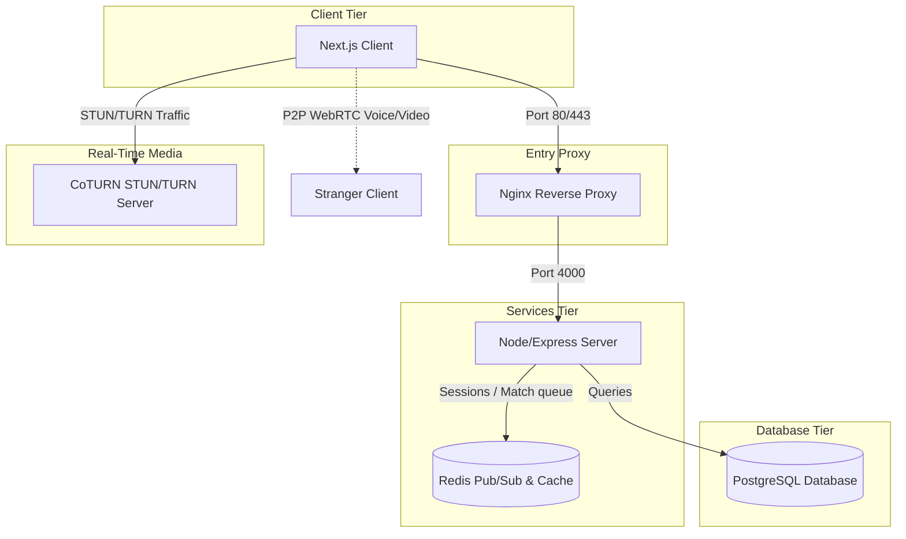
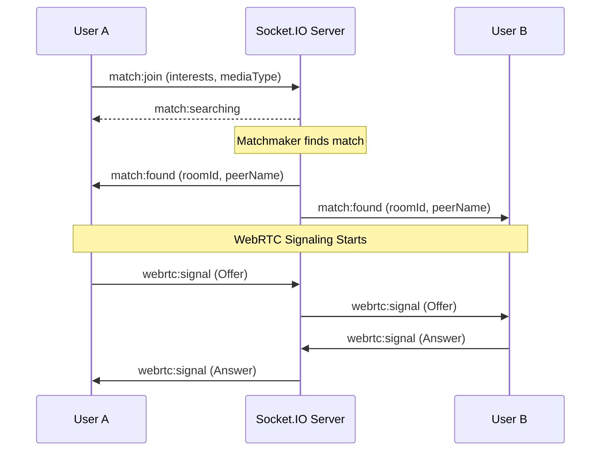

# System Architecture: AnonLink

AnonLink is built as a modular, scalable, containerized real-time communications application. This document details the component boundaries, direct connections, and system interactions.

---

## 1. High-Level Component Layout

---

## 2. Component Specifications

### Nginx reverse proxy
Acts as the single gateway for all web traffic:
* Serves static frontend bundles.
* Handles TLS/SSL termination with certificates provided by Let's Encrypt Certbot.
* Routes HTTP `/api/v1` calls to the Node.js backend.
* Forwards WebSocket traffic securely by upgrading connection headers.

### Next.js Frontend
* Implements the UI views using React, Tailwind CSS, and Lucide icons.
* Manages client states using Zustand (`chatStore`).
* Handles WebRTC state and RTCPeerConnection negotiation (`useWebRTC` hook).
* Maintains a persistent Socket.IO connection for signaling and text messaging (`useSocket` hook).

### Express Backend
* Standard Node.js REST API using TypeScript.
* Exposes auth endpoints (OAuth callback, guest tokens), profiles, onboarding status, and subscription checks.
* Orchestrates background scheduling daemons (`scheduler.ts`) to clean up expiring items.

### PostgreSQL Database
* Datastore managed through Prisma ORM.
* Models include `User`, `Role`, `UserOnboarding`, `SubscriptionPlan`, `UserSubscription`, and `TemporaryMedia`.
* Ephemeral guest sessions are deleted on expiry.

### Redis Cache
* Matches queues (`matchmaking:queue:<type>`).
* Holds temporary matchmaking tickets (`matchmaking:tickets`).
* Tracks active socket connections (`active_socket:<userId>`).
* Provides global feature flags (`feature:voice_enabled`, `feature:video_enabled`).

### Socket.IO Real-Time Messaging & Signaling
Socket.IO handles matching commands and acts as the signaling channel for WebRTC.

---

## 3. Security Architecture
1. **CSRF Protection**: State cookies verify OAuth verification flows.
2. **Encrypted Passwords**: Argon2 is used for standard password hashing.
3. **JWT Access Tokens**: Issued in secure HTTP-only cookies to prevent XSS credential stealing.
4. **Ephemerality**: Media shared in chats is strictly stored on an un-indexed file path (`tmp/media/`) and auto-deleted in 60 seconds.
5. **No Caching**: Ephemeral media endpoint sends strict no-cache/no-store HTTP headers.
6. **Screenshot Protection**: Right-clicks on images are blocked; copy, drag, and selection actions are disabled via CSS.
