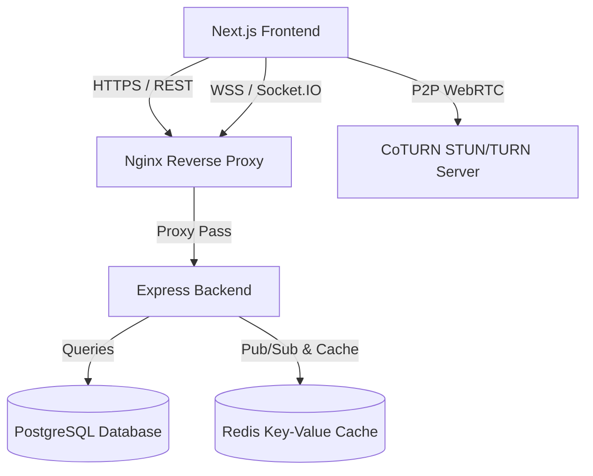

# Project Context: AnonLink

AnonLink is a state-of-the-art, secure, and privacy-first anonymous chat platform that facilitates instant, real-time connections (text, voice, and video) between users globally. The system is designed to provide high-quality matching, robust moderation, and subscription-gated advanced features while strictly respecting user privacy.

---

## 1. Project Purpose
The primary purpose of AnonLink is to allow people to connect anonymously online without the risk of data leakage, tracking, or identity exposure. All communication is transient, data storage is minimized, and media shares are strictly ephemeral.

---

## 2. Features

### Core Messaging
* **Real-Time Text Chat**: Instant messaging via Socket.IO.
* **Typing Indicators**: Visual feedback when the peer is typing.
* **Match Skipping**: Instantly leave the current room and rejoin the queue for a new stranger.

### Multimedia Communication
* **Voice Chat**: WebRTC-based high-quality peer-to-peer voice calls (gated).
* **Video Chat**: WebRTC-based high-quality video calling with dual-camera view layouts (gated).
* **Screen Sharing**: Ability to stream desktop screens to peers during video calls.

### Onboarding & Identity Gating
* **Anonymous Guest Access**: Immediate guest tokens for friction-free chat initiation.
* **Google OAuth 2.0**: Secure registration and account linking using Google Sign-in.
* **Privacy-First Onboarding**: Compulsory onboarding flow to collect age range and gender without personal identifier linkage.

### Matchmaking & Reputation
* **Interest-Based Matching**: Matches users sharing identical interest tags.
* **Starvation Prevention**: Starved matching thresholds that lower score bounds dynamically over time.
* **Reputation Engine**: Score-based queue routing punishing bad behavior (skips, reports) and rewarding longevity.
* **Gender preference filtering**: Ability for Paid users to match only with peers conforming to chosen gender orientations.

### Moderation & Appeals
* **Content Moderation**: Automated regex profanity filtering and scam link blockers.
* **Reporting & Blocking**: Action triggers allowing users to block or report peers.
* **Shadow Banning**: Restricts bad actors to a separate shadow queue containing only other banned users.
* **Appeals Console**: Interface allowing restricted users to appeal bans to administrators.

### Subscription & Features Gating
* **Subscription Tiers (Free vs Paid)**: Paid subscriptions unlock Voice, Video, and Gender Filtering.
* **Mock Billing Engine**: Modular payment structure ready for Razorpay/Stripe integrations.
* **Global Overrides**: Admin controls to globally enable/disable Voice or Video capabilities.

---

## 3. Technology Stack

### Backend
* **Runtime**: Node.js (TypeScript)
* **Framework**: Express.js
* **Database Client**: Prisma ORM
* **Real-time Engine**: Socket.IO
* **Caches & Queues**: Redis (v7)

### Frontend
* **Framework**: Next.js (App Router, Tailwind CSS, Lucide icons)
* **State Management**: Zustand
* **Signaling & P2P**: WebRTC (Simple-peer / Native RTCPeerConnection)

### Infrastructure
* **Web Server / Reverse Proxy**: Nginx (with SSL termination via Let's Encrypt Certbot)
* **Containerization**: Docker Compose
* **Turn/Stun Infrastructure**: CoTURN

---

## 4. System Architecture



---

## 5. Folder Structure

```
anon-chat-platform/
├── backend/
│   ├── prisma/             # Schema files & migration seeds
│   ├── src/
│   │   ├── config/         # DB, Redis connection clients
│   │   ├── middleware/     # Auth, role, feature guards
│   │   ├── routes/         # REST API Route definitions
│   │   ├── services/       # Matchmaking, Subscriptions, Ephemeral Media
│   │   ├── sockets/        # Socket.IO Event Handlers
│   │   └── index.ts        # Server entry point
│   └── tsconfig.json
├── frontend/
│   ├── public/             # Static Assets
│   ├── src/
│   │   ├── app/            # Next.js App Router Page definitions
│   │   ├── hooks/          # useSocket, useWebRTC hooks
│   │   └── store/          # Zustand state store (chatStore)
│   └── tsconfig.json
├── packages/
│   └── types/              # Monorepo Shared TypeScript Interfaces
├── docker-compose.yml
├── nginx/
│   └── nginx.conf          # Nginx virtual servers & SSL config
└── docs/                   # Handover documentation
```

---

## 6. Authentication Flow
1. **Guest Sign-in**: `/api/v1/auth/guest` generates a JWT token containing a random UUID and saves a GuestSession record.
2. **Google OAuth**: `/api/v1/auth/google` handles the secure OAuth flow, registering the Google ID, setting HttpOnly cookies, and issuing JWT access tokens.
3. **Session Recovery**: `/api/v1/auth/session` validates active cookies/tokens, auto-renewing expired sessions via Refresh Tokens.

---

## 7. Matchmaking Flow
1. User calls `match:join` event.
2. Backend checks if user is restricted/muted, validates subscription feature access for Voice/Video, and fetches uploader gender attributes.
3. Ticket is registered in the Redis matchmaking hash queue.
4. Loop evaluates candidate compatibility scores based on interests, languages, and reputation difference.
5. If mutual gender preferences are active, only compatible tickets are matched.
6. When score passes the threshold, a room UUID is generated, and both users are notified to join.

---

## 8. WebRTC & Socket.IO Architecture
* **Signaling**: WebRTC signaling messages (`webrtc:signal`) are relayed over Socket.IO rooms.
* **P2P Connection**: Direct WebRTC peer connection is established using CoTURN STUN/TURN servers to bypass NAT firewalls.
* **Fallback**: Standard Socket.IO chat messages are used if WebRTC connection fails.

---

## 9. Ephemeral Media System
* **Temporary Media**: Uploaded images are stored in `tmp/media/` and expire in exactly 60 seconds.
* **Cleanup Daemon**: Background scheduler unlinks expired files from disk every 30 seconds.
* **Screenshot Deterrence**: Served images are styled with timer overlays, right-click actions are intercepted, and drag-and-drop actions are disabled.

---

## 10. Coding Standards
* **Language**: TypeScript (strict mode enabled).
* **Format**: Prettier formatting with ESLint verification.
* **Imports**: Native ES modules (`.js` suffix required in backend TS imports).
* **Database**: Always access PostgreSQL using Prisma Client queries, never write raw queries unless performing database seeding.
