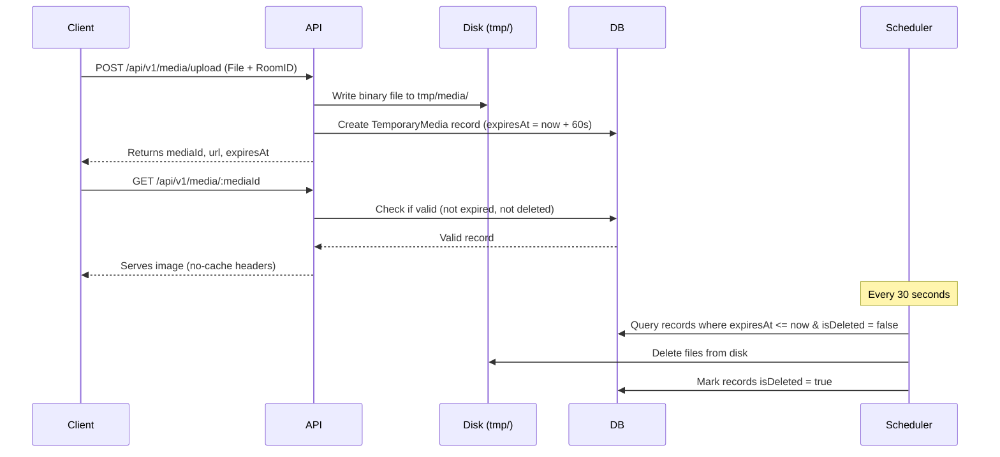

# Temporary Media Storage and Screenshot Protection

Images shared in chat are highly ephemeral. They disappear permanently after 60 seconds.

## Ephemeral Storage Flow

## Deterring Image Saving
To discourage screenshotting and unauthorized image saving:
1. **Right-Click Deterrence**: Right-click is explicitly intercepted on the img element.
2. **Select & Drag Disabled**: Text/image selection and dragging properties are disabled.
3. **No Caching**: Server sends strict headers:
   `Cache-Control: no-store, no-cache, must-revalidate, max-age=0`
4. **Watermark / Overlay**: Overlays the remaining timer directly on top of the image.
